# Dragun Cafe - 6 Hour Hackathon Submission

## Table of Contents

- [Description](#description)
  - [Team Members](#team-members)
- [Problem Statement](#problem-statement)
  - [System Requirements](#your-system-should-have-the-following-features)
- [Preview of the App](#preview-of-the-app)
  - [Splash Screen](#splash-screen)
  - [Main Activity](#main-activity)
  - [View Product](#view-product)
  - [Add Product](#add-product)
  - [Edit Product](#edit-product)
  - [Sellable Product Logs](#sellable-product-logs)
  - [Dialogs](#dialogs)

## Description

This is the winning submission for the Tagisan ng Talino 2025 CodeFest hackathon at the local level on STI College Ortigas-Cainta. The development time given on the Hackathon was **6 hours** inside a computer laboratory at the academic building. The awarding ceremony took place on the same day.

### Team Members

- [Marc Plarisan](https://github.com/DragunWF) - _Team Captain_
- [Jay Arnon Sinahunon](https://github.com/JasDevPH)
- [Isaac Severino](https://github.com/Aysaaak)

## Problem Statement

You are an aspiring coffee shop owner, however you have difficulties on checking the stocks of your ingredients. You also often find it hard to manage restocking your ingredients due to your manual usage of pen and paper. Additionally you also have a hard time on managing the salable and unsalable products. In order to solve your dilemma, you need to create a sales and inventory system that enables you to manage the data.

### Your system should have the following features

#### 2 Categories for filter

- [x] Sellable Inventory
  - It consists of products that can be purchased.
- [x] Non-Sellable Inventory
  - It consists of products that are used to create products.

#### Application Features

- [x] Menu for coffee shop products (limit of 6 to 10 products)
- [x] Item search for products
- [x] Able to delete and add products
- [x] Filters on item products
- [x] Product details sellable and non-sellable
- [x] Product logs of sellable items

## Preview of the App

### Splash Screen

    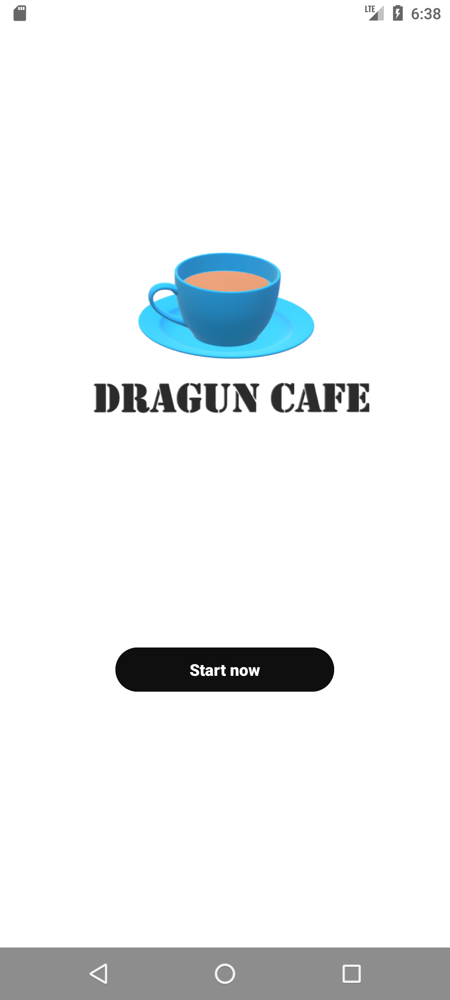

### Main Activity

    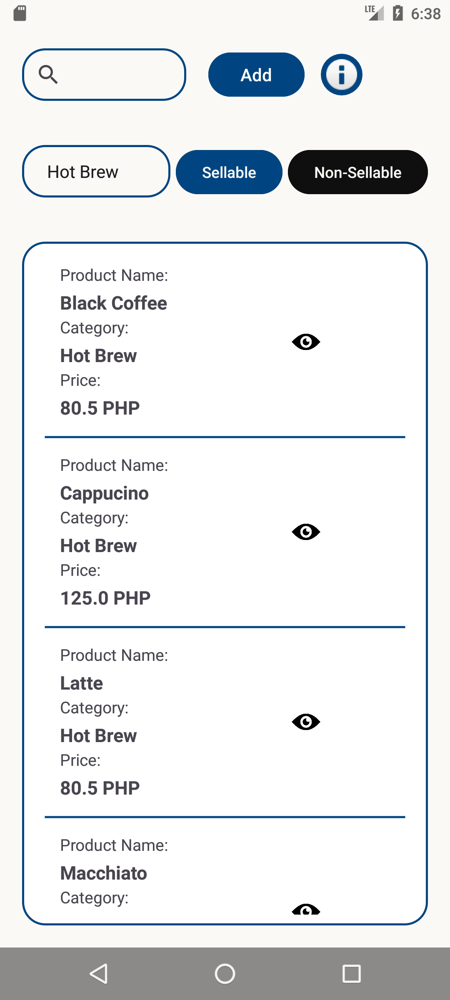
    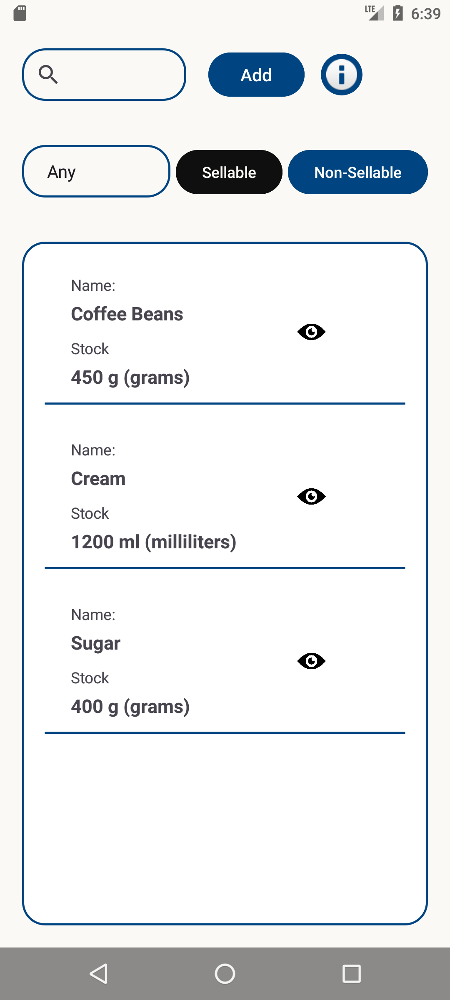

### View Product

    
    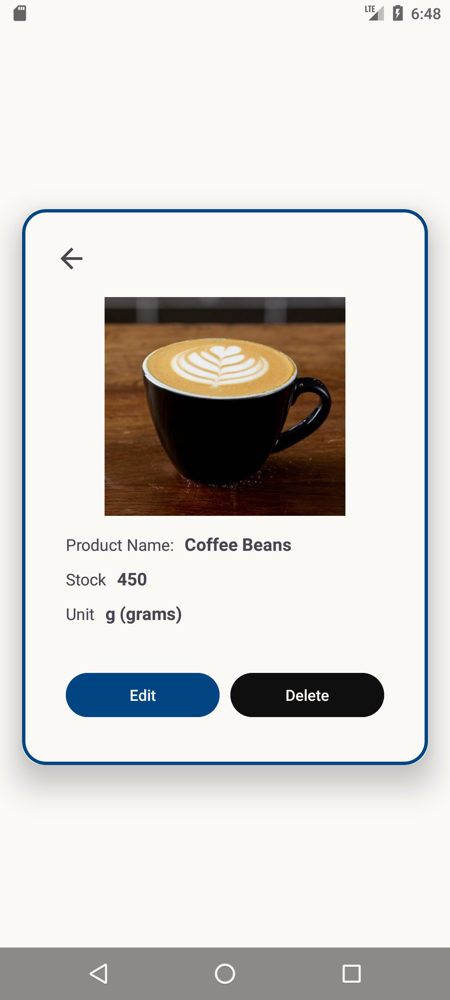

### Add Product

    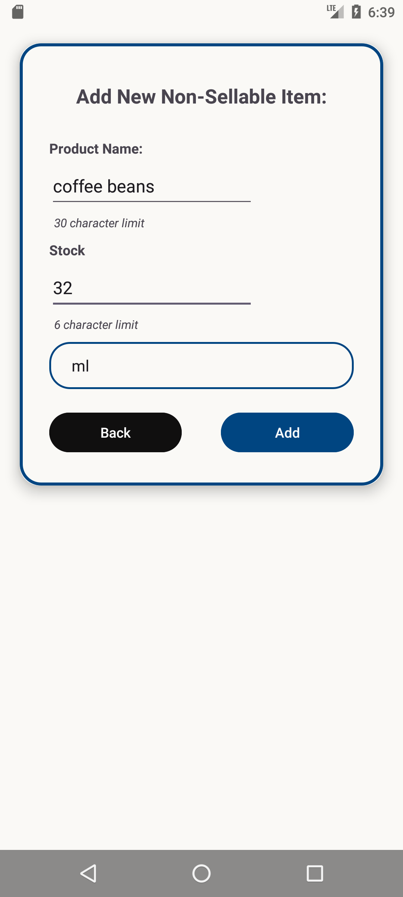
    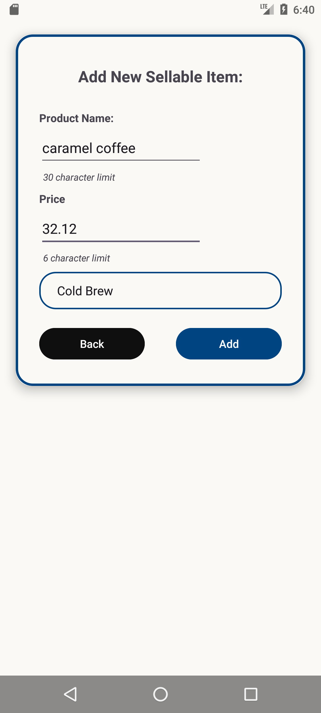

### Edit Product

    
    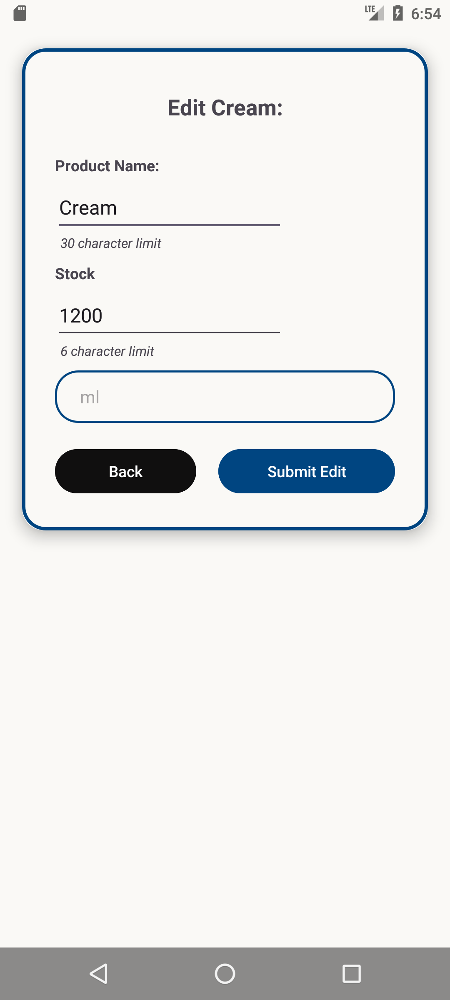

### Sellable Product Logs

    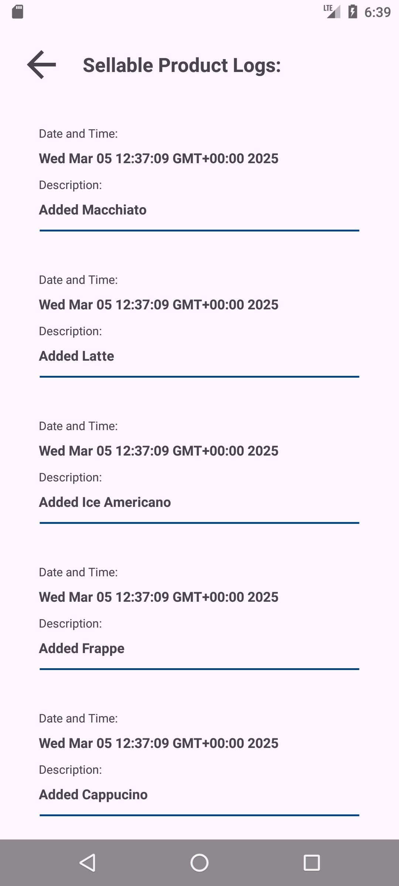
    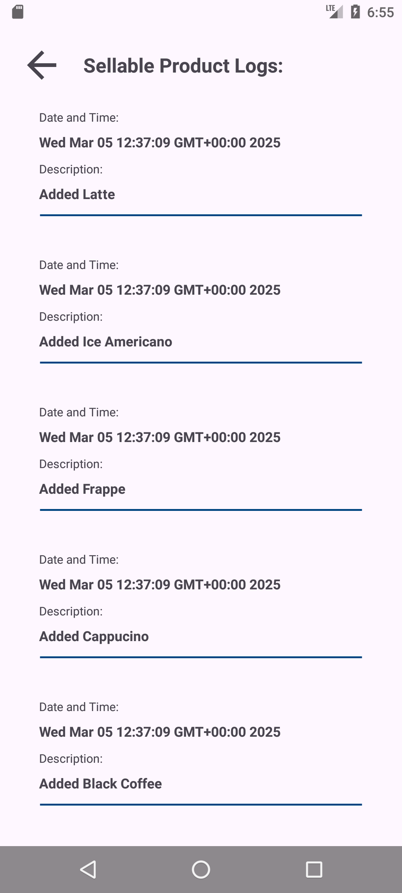

### Dialogs

    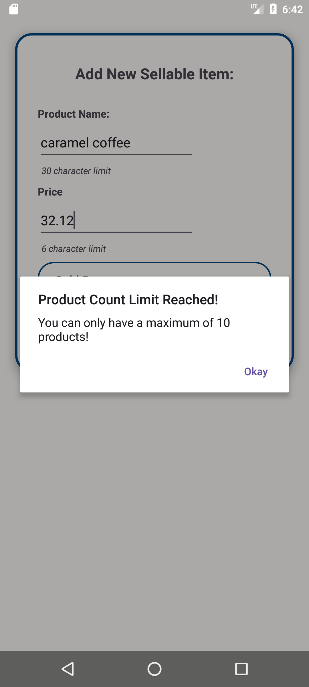
    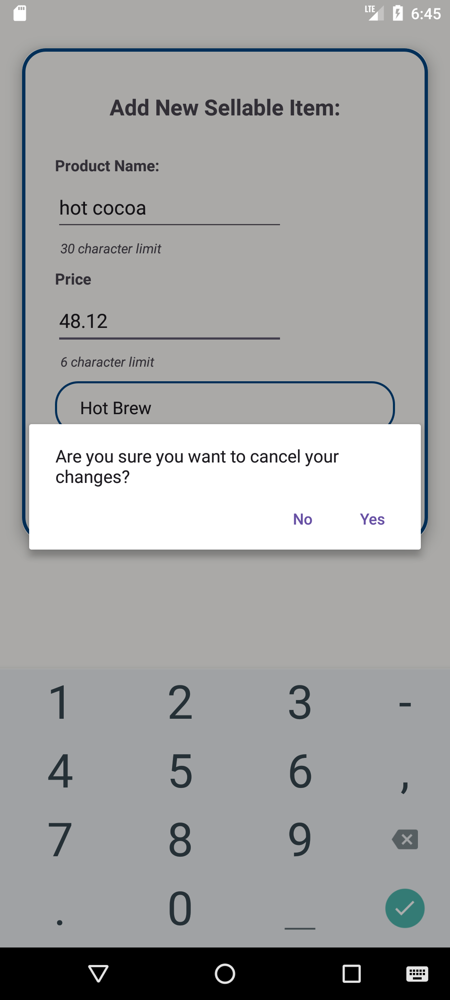
    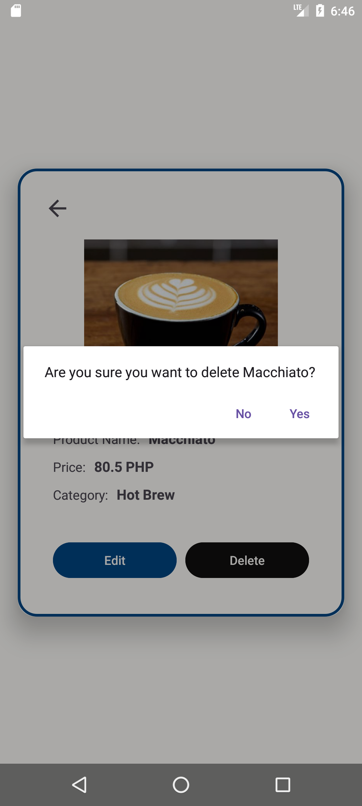
    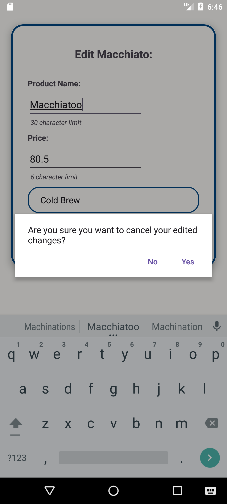

